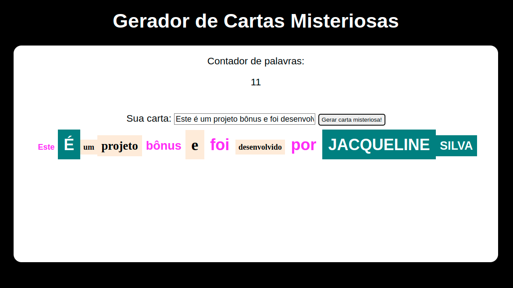

# Projeto Mistery Letter

:rocket: *Desenvolvido em: 09/12/2021 - Bloco 05/Trybe*

## :dart: Objetivo

Desenvolver uma página web que gere uma carta misteriosa, onde cada palavra parece ser retirada de uma revista ou jornal diferentes, com variações de tamanho e estilo da fonte e cor de fundo.

## :brain: Habilidades desenvolvidas

- Manipular o DOM
- Utilizar o Javascript
- Estilizar a página web com o CSS

## :hammer_and_wrench: Ferramentas utilizadas

- HTML
- Javascript
- CSS

:zap: *Todos os projetos da Trybe utilizam ESlint e Stylelint*

## :mailbox: Contatos

